**Unir equips al domini**
Per connectar un client al domini LDAP, primer instal·larem el paquet necessari::

apt install libnss-ldap libpam-ldap nscd
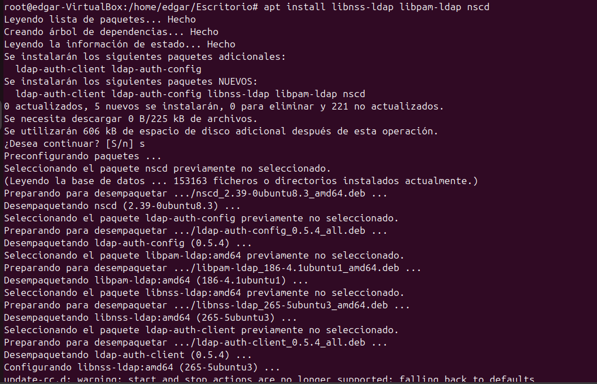
Durant la instal·lació, apareixerà un assistent de configuració on haurem d'introduir la IP del servidor LDAP.
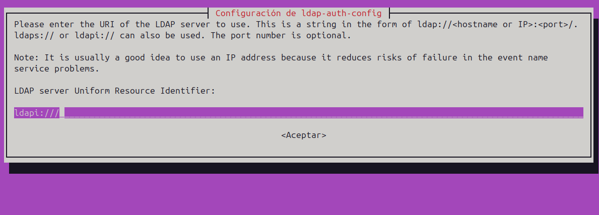
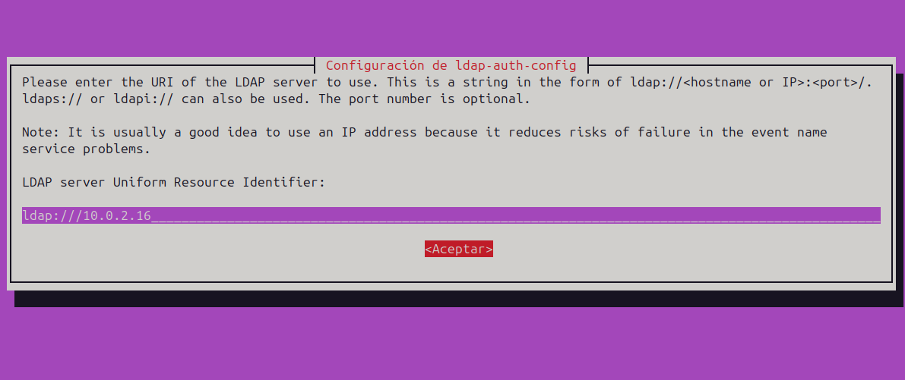
Després, completarem la configuració indicant els noms de domini definits prèviament.

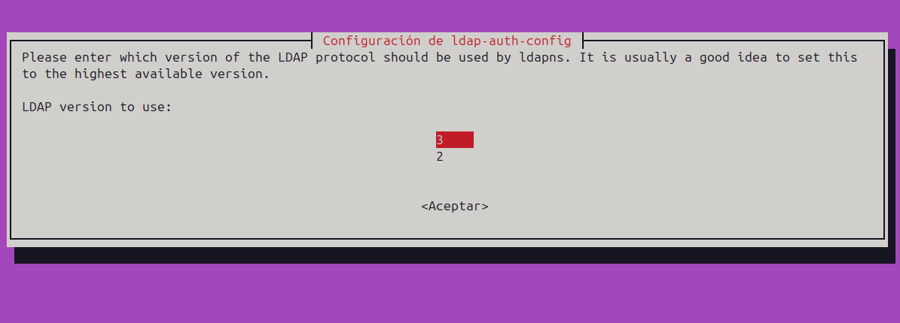
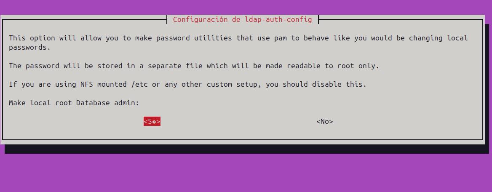
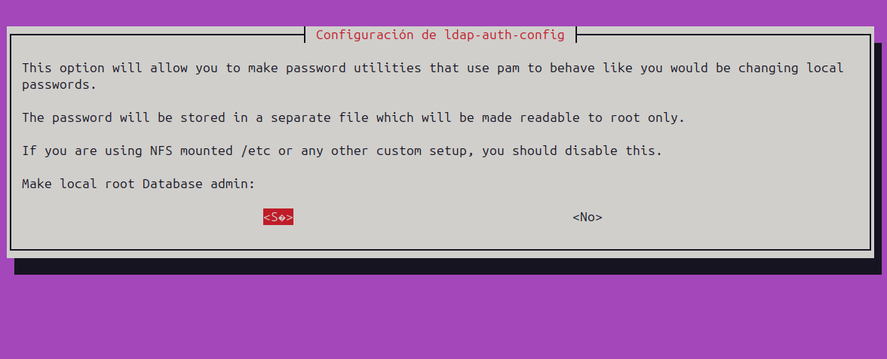
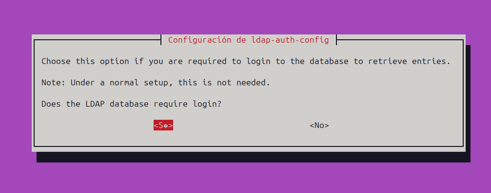
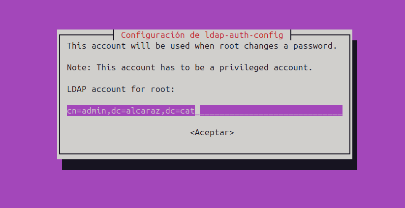
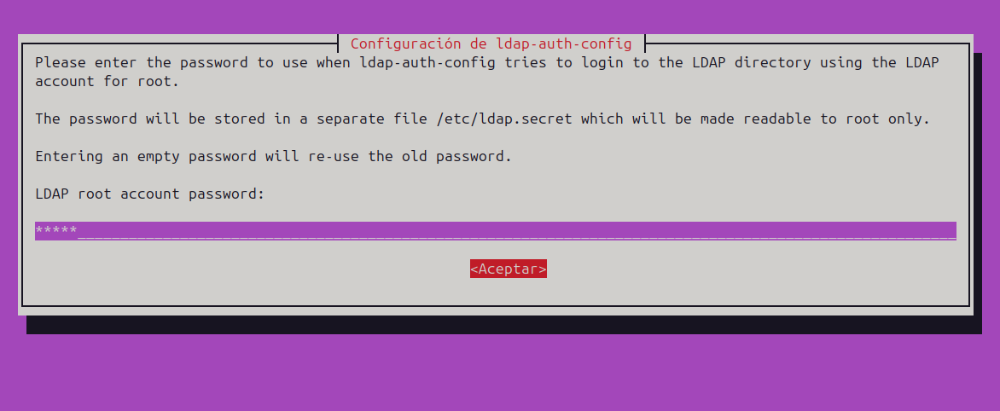
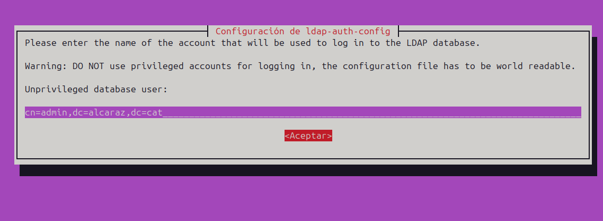
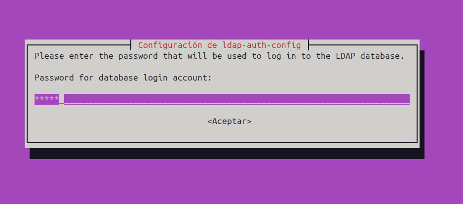

Després d'haver configurat el paquet, el següent pas consisteix a modificar certs paràmetres del client per garantir que es prioritzi la detecció del servidor LDAP. Per aconseguir-ho, haurem d'editar el fitxer etc/nsswitch.conf.
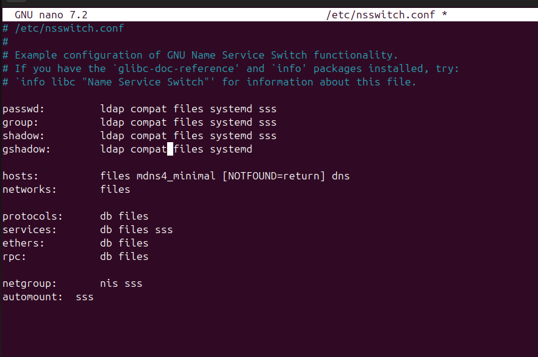

D'aquesta manera, ens assegurem que el sistema revisi primer els usuaris emmagatzemats al directori LDAP abans de consultar altres fonts. Concretament, estem indicant que es comprovin els fitxers relacionats amb usuaris, grups i contrasenyes.

També ajustarem etc/pam.d/common-session perquè es creïn automàticament els directoris d’usuari:
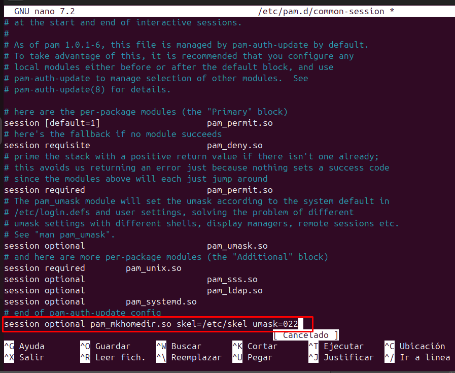

Aquest canvi farà que quan un usuari inicia sessió i no té un directori principal, se li crea automàticament un nou directori principal amb el contingut de /etc/skel i amb els permisos especificats per umask=022.

Per acabar de configurar el client, també ajustarem l'entorn d'autenticació per permetre als usuaris iniciar sessió manualment.
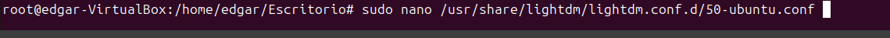
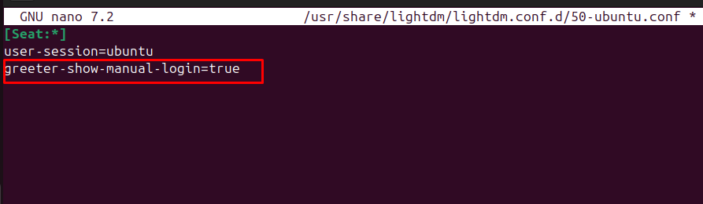

Amb aquesta configuració, el gestor de pantalla mostrarà una opció perquè els usuaris introdueixin el seu nom d'usuari de manera manual, en lloc d'haver de seleccionar-lo d'una llista. Aquesta funcionalitat és especialment útil en sistemes amb un gran nombre d'usuaris o en entorns on es necessita més flexibilitat en l'accés.

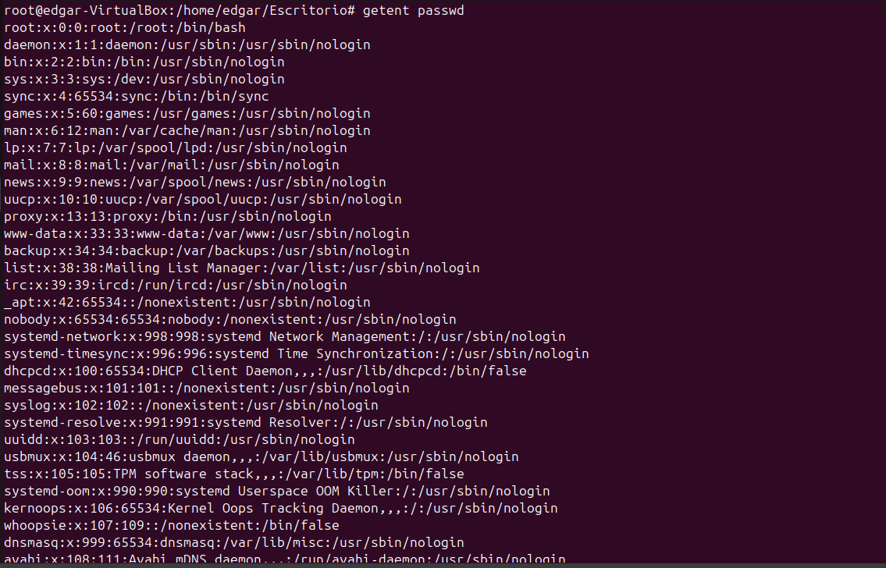

**Gestió del domini**
Per estructurar l'organització i començar a gestionar usuaris, hi ha dues opcions principals: treballar amb fitxers LDIF o utilitzar comandes directament. En aquest apartat, ens centrarem en l'ús de comandes essencials com search, add, modify i delete.

Abans de començar, comprovarem que el domini s'ha creat correctament i després revisarem els fitxers preparats a l'escriptori que contenen informació sobre els usuaris.

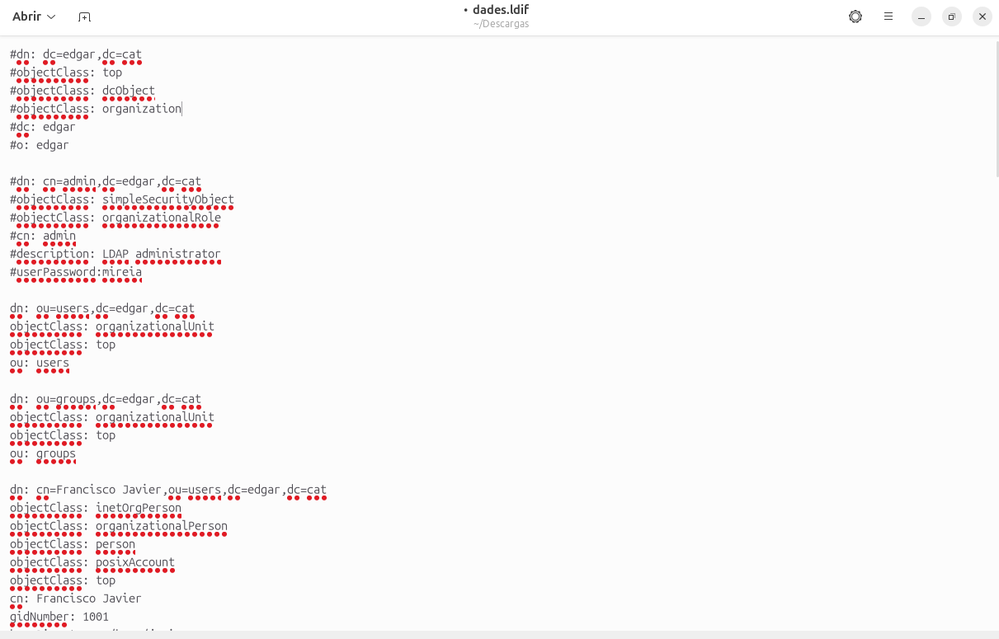
*ldapadd*
Tal com es pot observar, el fitxer inclou diverses dades d'usuaris que volem incorporar al sistema. Ho farem utilitzant la comanda ldapadd.

Per registrar els usuaris definits en el fitxer LDIF, executarem la comanda següent:

ldapadd -x -D "cn=admin,dc=edgar,dc=cat" -w -f dades.ldif
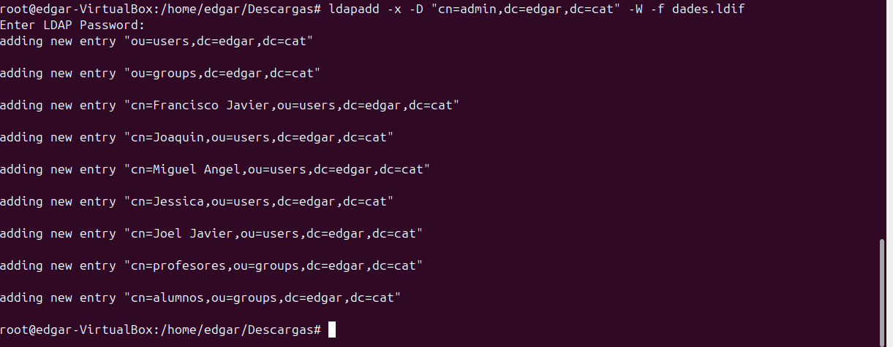

*ldapsearch*
Un cop els usuaris s'han creat correctament, podem verificar-ne l'existència amb la comanda ldapsearch:

ldapsearch -xLLL -b "dc=edgar,dc=cat"
A més, podem aplicar diferents filtres de cerca per trobar usuaris segons el seu uid, objectClass, correu electrònic, o qualsevol altra propietat rellevant
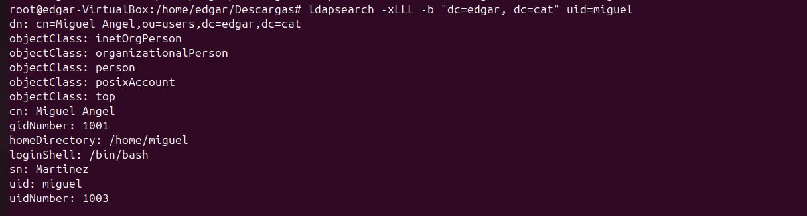
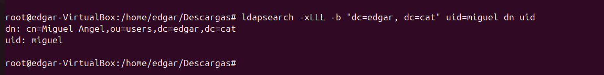
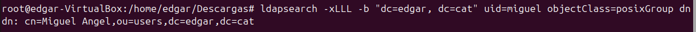
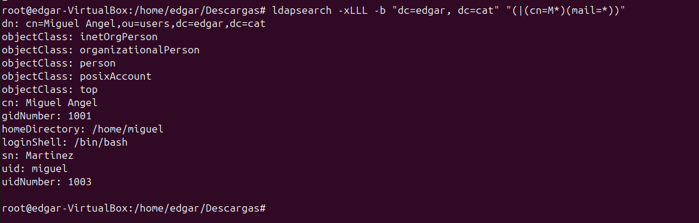
